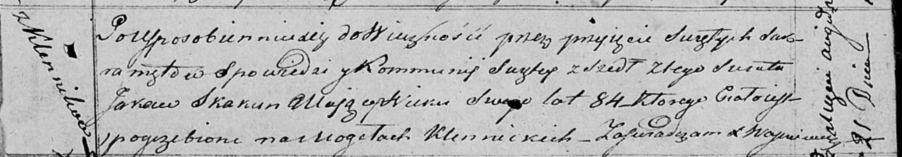

**Скакун Яков (Skakun Jakow)**

21 августа 1818 г -- отпевание, умер в возрасте 84 лет (родился около
1734 г) (НИАБ 136-13-919, лист 32, №17/1818-у (ориг)).

**НИАБ 136-13-919:** Лист 32. **Метрическая запись №17/1818-у (ориг).**

Осовская униатская церковь. 21 августа 1818 года. Метрическая запись об
отпевании.

Skakun Jakow -- умерший, 84 года, с деревни Клинники, похоронен на
кладбище деревни Клинники.

Woyniewicz Tomasz -- ксёндз.
