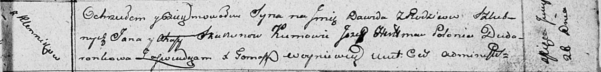

**Скакун Агафия (Skakunowa Ahafija)**

26 июня 1811 г -- крещение сына Давида (НИАБ 136-13-894, лист 81,
№31/1811-р (ориг)).

**НИАБ 136-13-894:** Лист 81. **Метрическая запись №31/1811-р (ориг).**

{width="6.496527777777778in"
height="0.7905260279965004in"}

Осовская Покровская церковь. 26 июня 1811 года. Метрическая запись о
крещении.

Skakun Dawid -- сын родителей с деревни Клинники.

Skakun Jan -- отец.

Skakunowa Ahafija -- мать.

Hertman Jozef -- кум.

Dudaronkowa Palanieja -- кума.

Woyniewicz Tomasz -- ксёндз.
