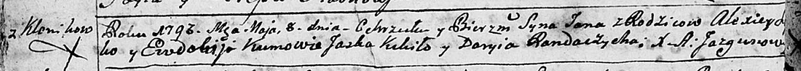
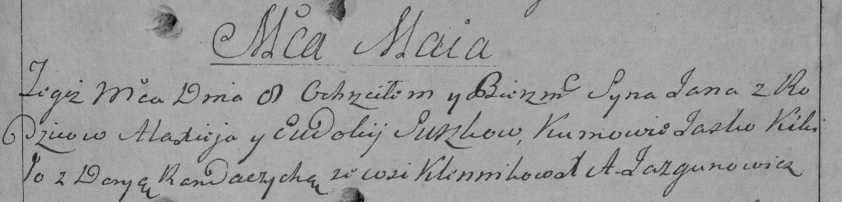
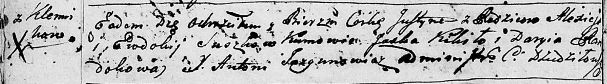
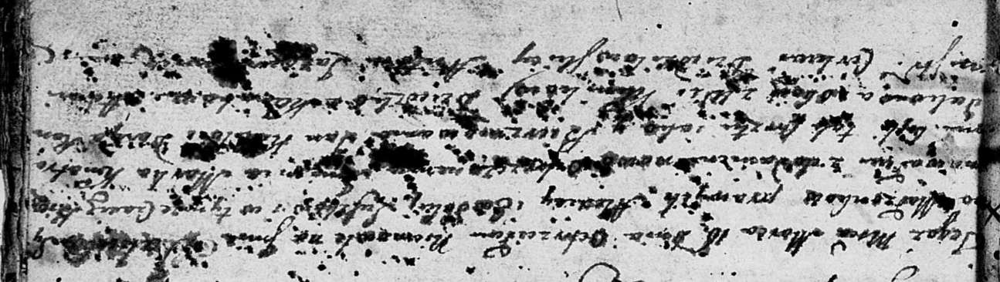
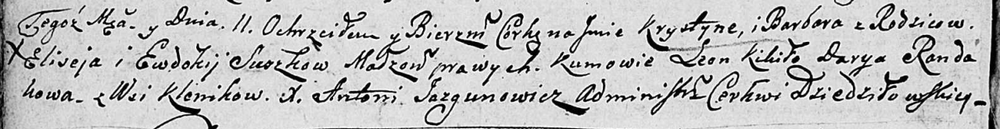

**Сушкова Евдокия (Suszkowa Ewdokija)**

8 мая 1793 г -- крещение сына Яна (НИАБ 136-13-894, лист 19об,
№38/1793-р (ориг)), (РГИА 823-2-18, лист 247, №18/1793-р (коп)).

20 января 1796 г -- крещение дочери Юстыны (НИАБ 136-13-894, лист 27об,
№10/1796-р (ориг)).

18 марта 1802 г -- крещение сына Якуба? Марка (НИАБ 136-13-894, лист 36,
№12/1802-р (ориг)).

11 марта 1806 г -- крещение дочери Крыстыны Варвары (НИАБ 136-13-894,
лист 59об, №12/1806-р (ориг)).

**НИАБ 136-13-894:** Лист 19-об. **Метрическая запись №38/1793-р
(ориг).**

Дедиловичская Покровская церковь. 8 мая 1793 года. Метрическая запись о
крещении.

\...ko Jan -- сын родителей с деревни Клинники.

\...ko Alexiey -- отец.

\...ko Ewdokija -- мать.

Kikiło Jaśka - кум.

Randaczycha Daryia - кума.

**РГИА 823-2-18:** Лист 247. **Метрическая запись №18/1793-р (коп).**

Дедиловичская Покровская церковь. 8 мая 1793 года. Метрическая запись о
крещении.

Suszko Jan -- сын родителей с деревни Клинники.

Suszko Alaxiey -- отец.

Suszkowa Eudokija -- мать.

Kikiło Jasko -- кум.

Randaczycha Darya -- кума.

Jazgunowicz Antoni -- ксёндз.

**НИАБ 136-13-894:** Лист 27об. **Метрическая запись №10/1796-р
(ориг).**

Дедиловичская Покровская церковь. 20 января 1796 года. Метрическая
запись о крещении.

Suszkowa Justyna -- дочь родителей с деревни Клинники.

Suszko Aliexiey -- отец.

Suszkowa Ewdokija -- мать.

Kikiło Jaśka - кум.

Randokowa Daryia - кума.

Jazgunowicz Antoni -- ксёндз.

**НИАБ 136-13-894:** Лист 46. **Метрическая запись №12/1802-р (ориг).**

Дедиловичская Покровская церковь. 18 марта 1802 года. Метрическая запись
о крещении.

Suszko Jakub? Markо -- сын родителей с деревни Клинники.

Suszko Alexiеy -- отец.

Suszkowa Ewdokija -- мать.

Kikiło Jan -- кум, с деревни Клинники.

Randakowa Daryia -- кума, с деревни Клинники.

Jazgunowicz Antoni -- ксёндз.

**НИАБ 136-13-894:** Лист 59об. **Метрическая запись №12/1806-р
(ориг).**

Дедиловичская Покровская церковь. 11 марта 1806 года. Метрическая запись
о крещении.

Suszkowna Krystyna Barbara -- дочь родителей с деревни Клинники.

Suszko Elisiey -- отец.

Suszkowa Ewdokija -- мать.

Kikiło Leon -- кум.

Randakowa Darya -- кума.

Jazgunowicz Antoni -- ксёндз.
