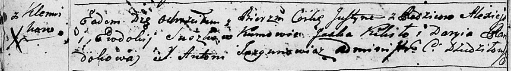

**Сушко Юстына Алексеева (Suszkowna Justyna)**

20 января 1796 г -- крещение (НИАБ 136-13-894, лист 27об, №10/1796-р
(ориг)).

**НИАБ 136-13-894:** Лист 27об. **Метрическая запись №10/1796-р
(ориг).**

{width="6.496527777777778in"
height="0.9058530183727034in"}

Дедиловичская Покровская церковь. 20 января 1796 года. Метрическая
запись о крещении.

Suszkowa Justyna -- дочь родителей с деревни Клинники.

Suszko Aliexiey -- отец.

Suszkowa Ewdokija -- мать.

Kikiło Jaśka - кум.

Randokowa Daryia - кума.

Jazgunowicz Antoni -- ксёндз.
