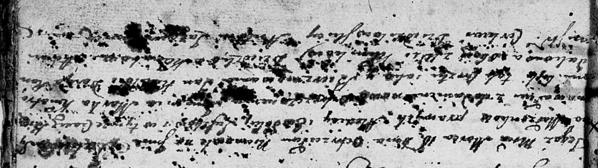

**Сушко Якуб? Алексеев (Suszko Jakub? Marko)**

18 марта 1802 г -- крещение (НИАБ 136-13-894, лист 36, №12/1802-р
(ориг)).

**НИАБ 136-13-894:** Лист 46. **Метрическая запись №12/1802-р (ориг).**

{width="6.496527777777778in"
height="1.8358442694663166in"}

Дедиловичская Покровская церковь. 18 марта 1802 года. Метрическая запись
о крещении.

Suszko Jakub? Markо -- сын родителей с деревни Клинники.

Suszko Alexiеy -- отец.

Suszkowa Ewdokija -- мать.

Kikiło Jan -- кум, с деревни Клинники.

Randakowa Daryia -- кума, с деревни Клинники.

Jazgunowicz Antoni -- ксёндз.
