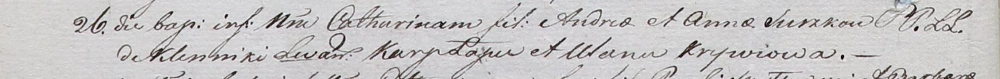

**Сушко Андрей (Suszko Andreas)**

26 ноября 1801 г -- крещение дочери Катарины (НИАБ 937-4-32, лист 4об,
№25/1801-р).

**НИАБ 937-4-32:** Лист 4об. **Метрическая запись №25/1801-р.**

Дедиловичский костел Наисвятейшего Сердца Иисуса. 26 ноября 1801 года.
Метрическая запись о крещении.

Suszkowna Catharina -- дочь родителей с деревни Клинники.

Suszko Andreas -- отец.

Suszkowa Anna -- мать.

Łapec Karp -- крестный отец.

Krywcowa Ulana -- крестная мать.

Linhart Hyacinthus -- ксёндз.
