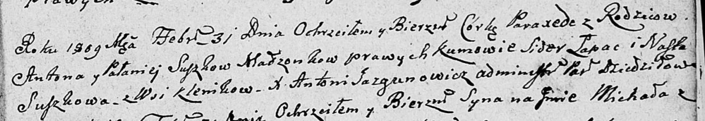

**Сушко Паланея (Suszkowa Pałanieja)**

31 февраля 1801 г -- крещение дочери Паракседы (НИАБ 136-13-894, лист
74, №13/1809-р (ориг)).

**НИАБ 136-13-894:** Лист 74. **Метрическая запись №13/1809-р (ориг).**

Дедиловичская Покровская церковь. 31 февраля 1809 года. Метрическая
запись о крещении .

Suszkowna Paraxeda -- дочь родителей с деревни Клинники.

Suszko Anton -- отец.

Suszkowa Pałanieja -- мать.

Łapać Sider -- кум.

Suszkowa Nasta -- кума.

Jazgunowicz Antoni -- ксёндз.
