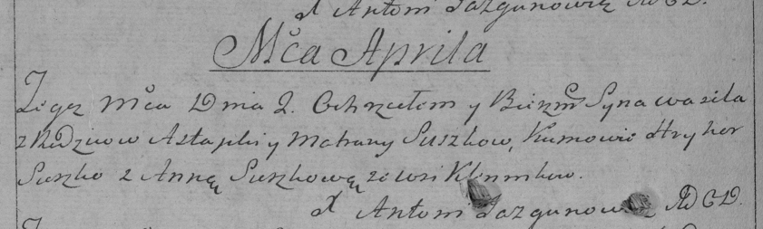

**Сушко Василь Астапов (Suszko Wasil)**

17 апреля 1790 г -- крещение (НИАБ 136-13-894, лист 9об, №23/1790-р
(ориг)), (РГИА 823-2-18, лист 239об, №11/1790-р (коп)).

**НИАБ 136-13-894:** Лист 9об. **Метрическая запись №23/1790-р (ориг).**

{width="6.496527777777778in"
height="1.1908180227471565in"}

Дедиловичская Покровская церковь. 17 апреля 1790 года. Метрическая
запись о крещении.

Suszko Wasil -- сын родителей с деревни Клинники.

Suszko Astapka -- отец.

Suszkowa Matruna -- мать.

Suszko Hryhor - кум.

Suszkowa Anna - кума.

Jazgunowicz Antoni -- ксёндз.

**РГИА 823-2-18:** Лист 239об. **Метрическая запись №11/1790-р (коп).**

{width="6.496527777777778in"
height="1.9541666666666666in"}

Дедиловичская Покровская церковь. 2 апреля 1790 года. Метрическая запись
о крещении.

Suszko Wasil -- сын родителей с деревни Клинники.

Suszko Astapka -- отец.

Suszko Matrona -- мать.

Suszko Hryhor -- кум.

Suszkowa Anna - кума.

Jazgunowicz Antoni -- ксёндз.
