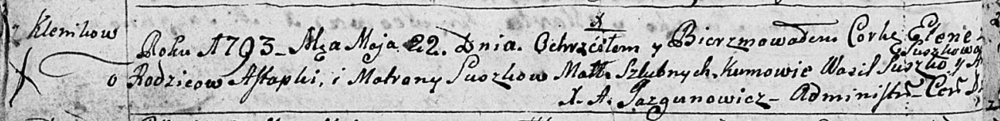

**Сушко Елена Астапова (Suszkowna Elena)**

22 мая 1793 г -- крещение (НИАБ 136-13-894, лист 19об, №44/1793-р
(ориг)).

**НИАБ 136-13-894:** Лист 19-об. **Метрическая запись №44/1793-р
(ориг).**

{width="6.496527777777778in"
height="0.7898556430446194in"}

Дедиловичская Покровская церковь. 22 мая 1793 года. Метрическая запись о
крещении.

Suszkowna Elena -- дочь родителей с деревни Клинники.

Suszko Astapka -- отец.

Suszkowa Matrona -- мать.

Suszko Wasil - кум.

Suszkowa ? - кума.

Jazgunowicz Antoni -- ксёндз.
