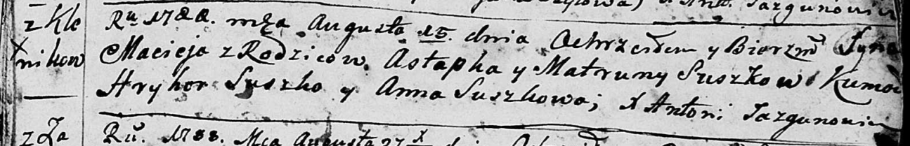
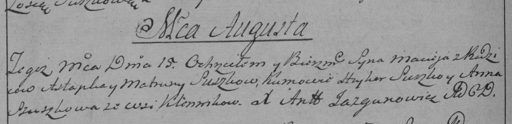

**Сушко Мацей Астапов (Suszko Maciej)**

15 августа 1788 г -- крещение сына Мацея (НИАБ 136-13-894, лист 5,
№42/1788-р (ориг)), (РГИА 823-2-18, лист 236об, №22/1788-р (коп)).

**НИАБ 136-13-894:** Лист 5. **Метрическая запись №42/1788-р (ориг).**

Дедиловичская Покровская церковь. 15 августа 1788 года. Метрическая
запись о крещении.

Suszko Maciej -- сын родителей с деревни Клинники.

Suszko Astapka -- отец.

Suszkowa Matruna -- мать.

Suszko Hryhor - кум.

Suszkowa Anna - кума.

Jazgunowicz Antoni -- ксёндз.

**РГИА 823-2-18:** Лист 236об. **Метрическая запись №22/1788-р (коп).**

Дедиловичская Покровская церковь. 15 августа 1788 года. Метрическая
запись о крещении.

Suszko Maciey -- сын родителей с деревни Клинники.

Suszko Astapka -- отец.

Suszkowa Matruna -- мать.

Suszko Hryhor -- кум.

Szuszkowa Anna - кума.

Jazgunowicz Antoni -- ксёндз.
