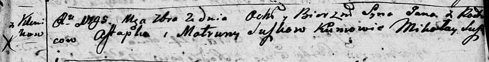
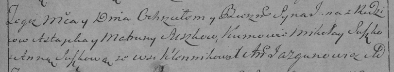

**Сушко Ян Астапов (Suszko Jan)**

2 сентября 1795 г -- крещение (НИАБ 136-13-894, лист 25, №33/1795-р
(ориг)), (РГИА 823-2-18, лист 253, №26/1795-р (коп)).

Лист 25. **Метрическая запись №33/1795-р (ориг).**

Дедиловичская Покровская церковь. 2 сентября 1795 года. Метрическая
запись о крещении.

Suszko Jan -- сын родителей с деревни Клинники.

Suszko Astapka -- отец.

Suszkowa Matruna -- мать.

Suszko Mikołay - кум.

**РГИА 823-2-18:** Лист 253. **Метрическая запись №26/1795-р (коп).**

Дедиловичская Покровская церковь. 2 сентября 1795 года. Метрическая
запись о крещении.

Suszko Jan -- сын родителей с деревни Клинники.

Suszko Astapka -- отец.

Suszkowa Matruna -- мать.

Suszko Mikołay -- кум.

Suszkowa Anna -- кума.

Jazgunowicz Antoni -- ксёндз.
