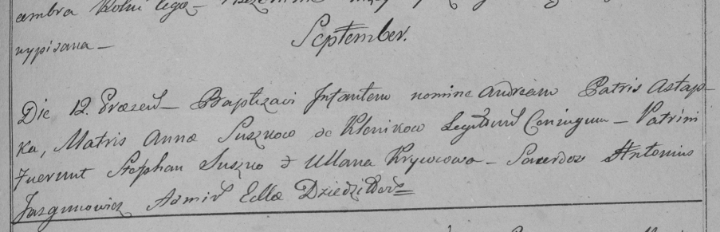

**Сушко Анна (Suszkowa Anna)**

12 сентября 1798 г -- крещение сына Андрея (РГИА 823-2-18, лист 266,
№41/1798-р (ориг)).

**РГИА 823-2-18:** Лист 266. **Метрическая запись №41/1798-р (коп).**

Дедиловичская Покровская церковь. 12 сентября 1798 года. Метрическая
запись о крещении.

Suszko Andrzey -- сын родителей с деревни Клинники.

Suszko Astapka -- отец.

Suszkowa Anna -- мать.

Suszko Stephan -- кум.

Krywcowa Ullana -- кума.

Jazgunowicz Antoni -- ксёндз.
