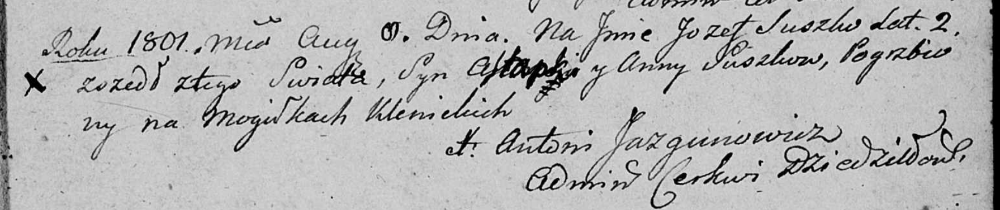

**Сушко Иосиф Астапков (Suszko Jozef)**

11 августа 1801 г -- отпевание, умер в возрасте 2 лет (родился около
1799 г) (НИАБ 136-13-919, лист 12, №18/1801-у (ориг)).

**НИАБ 136-13-919:** Лист 12. **Метрическая запись №18/1801-у (ориг).**

{width="6.496527777777778in"
height="1.3645833333333333in"}

Дедиловичская Покровская церковь. 11 августа 1801 года. Метрическая
запись об отпевании.

Suszko Jozef, syn Astapki y Anny Suszkow -- умерший, 2 года, с деревни
\[Клинники\], похоронен на кладбище деревни Клинники.

Jazgunowicz Antoni -- ксёндз.
