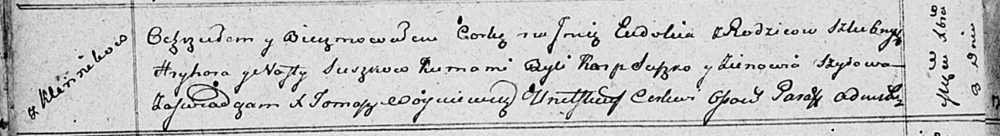

**Сушко Наста (Suszkowa Nasta)**

8 декабря 1811 г -- крещение дочери Евдокии (НИАБ 136-13-894, лист 82об,
№61/1811-р (ориг)).

**НИАБ 136-13-894:** Лист 82об. **Метрическая запись №61/1811-р
(ориг).**

Осовская Покровская церковь. 8 декабря 1811 года. Метрическая запись о
крещении.

Suszkowna Eudokija -- дочь родителей с деревни Клинники.

Suszko Hryhor -- отец.

Suszkowa Nasta -- мать.

Suszko Karp -- кум.

Szyłowa Zienowia -- кума.

Woyniewicz Tomasz -- ксёндз.
