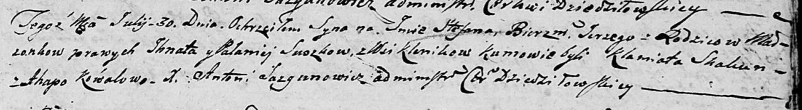

**Сушко Паланея (Suszkowa Pałanieja)**

30 июля 1805 г -- крещение сына Стефана Сергея (НИАБ 136-13-894, лист
58, №35/1805-р (ориг)).

**НИАБ 136-13-894:** Лист 58. **Метрическая запись №35/1805-р (ориг).**

{width="6.496527777777778in"
height="0.901159230096238in"}

Дедиловичская Покровская церковь. 30 июля 1805 года. Метрическая запись
о крещении.

Suszko Stefan Jerzy -- сын родителей с деревни Клинники.

Suszko Jhnat -- отец.

Suszko Pałanieja -- мать.

Skakun Klamiata -- кум.

Kowałowa Agata -- кума.

Jazgunowicz Antoni -- ксёндз.
