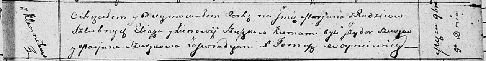

**Сушко Илья (Szuszko Eliasz)**

4 ноября 1811 г -- крещение дочери Марьяны (НИАБ 136-13-894, лист 82,
№54/1811-р (ориг)).

**НИАБ 136-13-894:** Лист 82. **Метрическая запись №54/1811-р (ориг).**

Осовская Покровская церковь. 4 ноября 1811 года. Метрическая запись о
крещении.

Szuszkowna Marjana -- дочь родителей с деревни Клинники.

Szuszko Eliasz -- отец.

Szuszkowa Zienowija -- мать.

Szuszko Jzydor -- кум.

Szuszkowa Marjana -- кума.

Woyniewicz Tomasz -- ксёндз.
