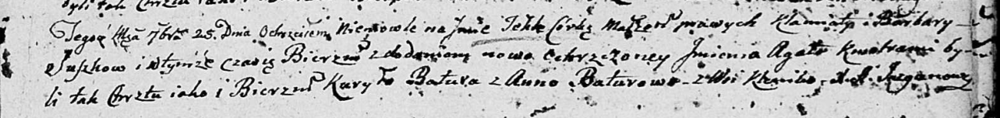

**Сушко Барбара (Suszkowa Barbara)**

25 сентября 1804 г -- крещение дочери Текли Агаты (НИАБ 136-13-894, лист
55, №39/1804-р (ориг)).

**НИАБ 136-13-894:** Лист 55. **Метрическая запись №39/1804-р (ориг).**

Дедиловичская Покровская церковь. 25 сентября 1804 года. Метрическая
запись о крещении.

Suszkowna Tekla Agata -- дочь родителей с деревни Клинники.

Suszko Klamiata -- отец.

Suszkowa Barbara -- мать.

Batura Kuryło -- кум.

Baturowa Anna -- кума.

Jazgunowicz Antoni -- ксёндз.
