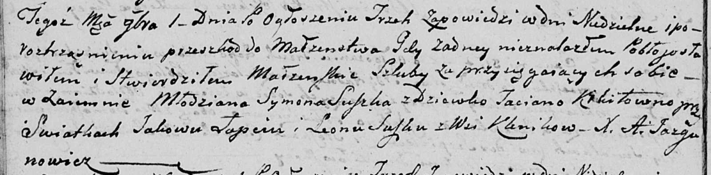

**Сушко Леон (Suszko Leon)**

6 июля 1791 г -- крещение дочери Анны (НИАБ 136-13-894, лист 13,
№29/1791-р (ориг)).

1 ноября 1803 г -- свидетель венчания молодого Сымона Сушко с деревни
Клинники с девкой Татьяной Кикило с деревни Клинники (НИАБ 136-13-920,
лист 9об, №8/1803-б (ориг)).

**НИАБ 136-13-894:** Лист 13. **Метрическая запись №29/1791-р (ориг).**

Дедиловичская Покровская церковь. 6 июля 1791 года. Метрическая запись о
крещении.

Suszkowna Anna -- дочь родителей с деревни Клинники.

Suszko Leon -- отец.

Suszkowa Uscinia -- мать.

Bautruk Leon -- кум.

Suszkowa Maryia - кума.

Jazgunowicz Antoni -- ксёндз.

**НИАБ 136-13-920:** Лист 9об. **Метрическая запись №8/1803-б (ориг).**

Дедиловичская Покровская церковь. 1 ноября 1803 года. Метрическая запись
о венчании.

Suszko Symon -- жених, молодой, с деревни \[Клинники\].

Kikiłowna Taciana -- невеста, девка, с деревни \[Клинники\].

Łapac Jakow -- свидетель.

Suszko Leon -- свидетель, с деревни Клинники.

Jazgunowicz Antoni -- ксёндз.
