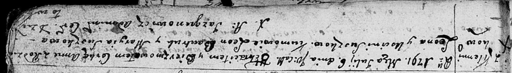

**Сушко Усцинья (Suszkowa Uscinia)**

6 июля 1791 г -- крещение дочери Анны (НИАБ 136-13-894, лист 13,
№29/1791-р (ориг)).

**НИАБ 136-13-894:** Лист 13. **Метрическая запись №29/1791-р (ориг).**

Дедиловичская Покровская церковь. 6 июля 1791 года. Метрическая запись о
крещении.

Suszkowna Anna -- дочь родителей с деревни Клинники.

Suszko Leon -- отец.

Suszkowa Uscinia -- мать.

Bautruk Leon -- кум.

Suszkowa Maryia - кума.

Jazgunowicz Antoni -- ксёндз.
