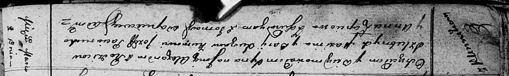

**Сушко Александр Максымов (Suszko Alexander)**

2 марта 1812 г -- крещение (НИАБ 136-13-894, лист 83об, №15/1812-р
(ориг)).

**НИАБ 136-13-894:** Лист 83об. **Метрическая запись №15/1812-р
(ориг).**

{width="6.496527777777778in"
height="0.9863134295713036in"}

Осовская Покровская церковь. 2 марта 1812 года. Метрическая запись о
крещении.

Suszko Alexander -- сын родителей с деревни Клинники.

Suszko Maxim -- отец.

Suszkowa Darija -- мать.

Paciarucho Jozef -- кум.

Lapciowa Anna -- кума.

Woyniewicz Tomasz -- ксёндз.
