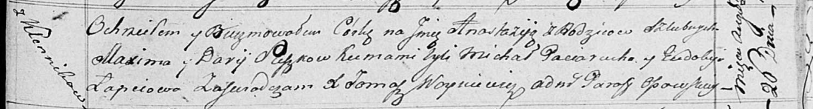

**Сушко Анастасия Максымова (Suszkowna Anastazija)**

26 августа 1817 г -- крещение (НИАБ 136-13-894, лист 97, №52/1817-р
(ориг)).

**НИАБ 136-13-894:** Лист 97. **Метрическая запись №52/1817-р (ориг).**

Осовская Покровская церковь. 26 августа 1817 года. Метрическая запись о
крещении.

Suszkowna Anastazija -- дочь родителей с деревни Клинники.

Suszko Maxim -- отец.

Suszkowa Darija -- мать.

Paciarucho Michał -- кум.

Łapciowa Eudokija -- кума.

Woyniewicz Tomasz -- ксёндз.
