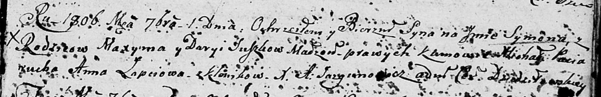
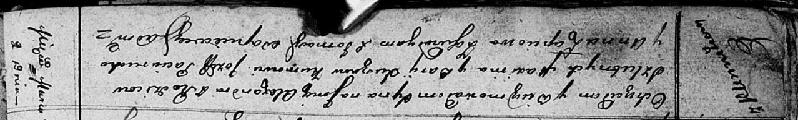
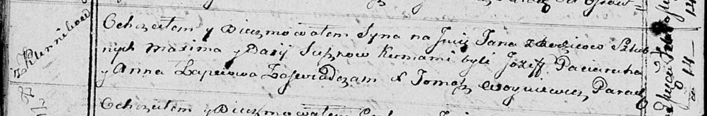
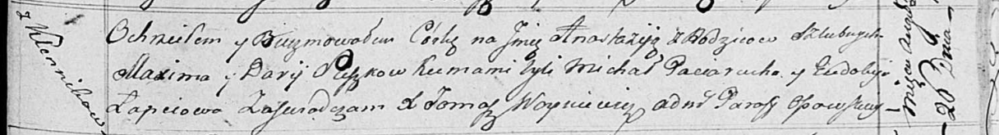
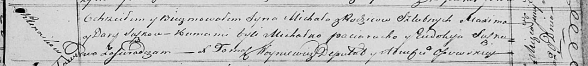

**Сушко Максым (Suszko Maxym, Maxim)**

1 сентября 1806 г -- крещение сына Сымона (НИАБ 136-13-894, лист 61,
№39/1806-р (ориг)).

2 марта 1812 г -- крещение сына Александра (НИАБ 136-13-894, лист 83об,
№15/1812-р (ориг)).

14 февраля 1815 г -- крещение сына Яна (НИАБ 136-13-894, лист 91об,
№7/1815-р (ориг)).

26 августа 1817 г -- крещение дочери Анастасии (НИАБ 136-13-894, лист
97, №52/1817-р (ориг)).

29 июня 1820 г -- крещение сына Михала (НИАБ 136-13-894, лист 104,
№19/1820-р (ориг)).

**НИАБ 136-13-894:** Лист 61. **Метрическая запись №39/1806-р (ориг).**

Дедиловичская Покровская церковь. 1 сентября 1806 года. Метрическая
запись о крещении.

Suszko Symon -- сын родителей с деревни Клинники.

Suszko Maxym -- отец.

Suszkowa Darya -- мать.

Paciarucha Michał -- кум.

Łapciowa Anna -- кума.

Jazgunowicz Antoni -- ксёндз.

**НИАБ 136-13-894:** Лист 83об. **Метрическая запись №15/1812-р
(ориг).**

Осовская Покровская церковь. 2 марта 1812 года. Метрическая запись о
крещении.

Suszko Alexander -- сын родителей с деревни Клинники.

Suszko Maxim -- отец.

Suszkowa Darija -- мать.

Paciarucho Jozef -- кум.

Lapciowa Anna -- кума.

Woyniewicz Tomasz -- ксёндз.

**НИАБ 136-13-894:** Лист 91об. **Метрическая запись №7/1815-р (ориг).**

Осовская Покровская церковь. 14 февраля 1815 года. Метрическая запись о
крещении.

Suszko Jan -- сын родителей с деревни Клинники.

Suszko Maxim -- отец.

Suszkowa Daria -- мать.

Paciarucha Jozef -- кум.

Łapciowa Anna -- кума.

Woyniewicz Tomasz -- ксёндз.

**НИАБ 136-13-894:** Лист 97. **Метрическая запись №52/1817-р (ориг).**

Осовская Покровская церковь. 26 августа 1817 года. Метрическая запись о
крещении.

Suszkowna Anastazija -- дочь родителей с деревни Клинники.

Suszko Maxim -- отец.

Suszkowa Darija -- мать.

Paciarucho Michał -- кум.

Łapciowa Eudokija -- кума.

Woyniewicz Tomasz -- ксёндз.

**НИАБ 136-13-894:** Лист 104. **Метрическая запись №19/1820-р (ориг).**

Осовская Покровская церковь. 29 июня 1820 года. Метрическая запись о
крещении.

Suszko Michał -- сын родителей с деревни Клинники.

Suszko Maxim -- отец.

Suszkowa Darija -- мать.

Paciarucha Michałko -- кум.

Suszkowa Eudokija -- кума.

Woyniewicz Tomasz -- ксёндз.
