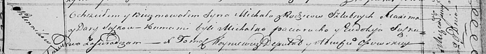

**Сушко Михал Максымов (Suszko Michał)**

29 июня 1820 г -- крещение (НИАБ 136-13-894, лист 104, №19/1820-р
(ориг)).

**НИАБ 136-13-894:** Лист 104. **Метрическая запись №19/1820-р (ориг).**

{width="6.496527777777778in"
height="0.7348742344706911in"}

Осовская Покровская церковь. 29 июня 1820 года. Метрическая запись о
крещении.

Suszko Michał -- сын родителей с деревни Клинники.

Suszko Maxim -- отец.

Suszkowa Darija -- мать.

Paciarucha Michałko -- кум.

Suszkowa Eudokija -- кума.

Woyniewicz Tomasz -- ксёндз.
