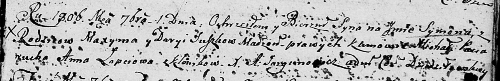

**Сушко Сымон Максымов (Suszko Symon)**

1 сентября 1806 г -- крещение (НИАБ 136-13-894, лист 61, №39/1806-р
(ориг)).

**НИАБ 136-13-894:** Лист 61. **Метрическая запись №39/1806-р (ориг).**

Дедиловичская Покровская церковь. 1 сентября 1806 года. Метрическая
запись о крещении.

Suszko Symon -- сын родителей с деревни Клинники.

Suszko Maxym -- отец.

Suszkowa Darya -- мать.

Paciarucha Michał -- кум.

Łapciowa Anna -- кума.

Jazgunowicz Antoni -- ксёндз.
