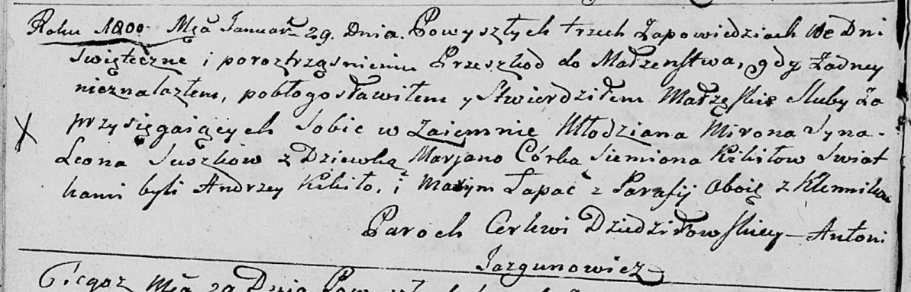
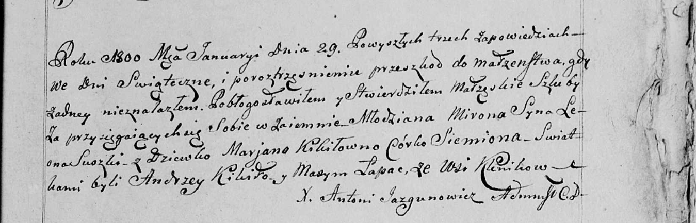
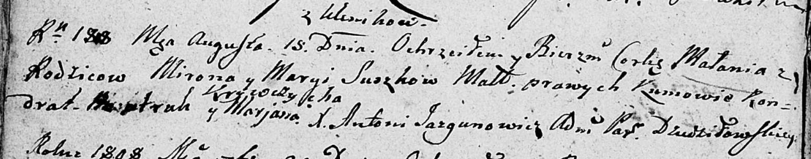

**Сушко (Кикило) Марыя, Марьяна (Suszkowa, Szuszkowa Marya, Marjana
córka Siemiona z Kikiłow)**

29 января 1800 г -- венчание с молодым Мироном Леоновым Сушко с деревни
Клинники (НИАБ 136-13-920, лист 6об, №1/1800-б (ориг), НИАБ 136-13-949,
лист 107, №1/1800-б (коп)).

15 августа 1808 г -- крещение дочери Маланьи (НИАБ 136-13-894, лист
65об, №27/1808-р (ориг)).

30 июня 1811 г -- крещение дочери Юстыны (НИАБ 136-13-894, лист 81,
№32/1811-р (ориг)).

7 июня 1814 г -- крещение дочери Юстыны младшей (НИАБ 136-13-894, лист
89об, №36/1814-р (ориг)).

1 июля 1817 г -- крещение дочери Петронели (НИАБ 136-13-894, лист 96об,
№44/1817-р (ориг)).

**НИАБ 136-13-894:** Лист 6об. **Метрическая запись №1/1800-б (ориг).**

Дедиловичская Покровская церковь. 29 января 1800 года. Метрическая
запись о венчании.

Suszko Miron syn Leona -- жених, молодой, с деревни \[Клинники\].

Kikiłowna Marjana córka Siemiona -- невеста, девка, с деревни
\[Клинники\].

Kikiło Andrzey -- свидетель, деревня Клинники.

Łapac Maxym -- свидетель, деревня Клинники.

Jazgunowicz Antoni -- ксёндз.

**НИАБ 136-13-949:** Лист 107. **Метрическая запись №1/1800-б (коп).**

(См. тж.: НИАБ 136-13-920, лист 6об, №1/1800-б (ориг))

Дедиловичская Покровская церковь. 29 января 1800 года. Метрическая
запись о венчании.

Suszko Miron, syn Leona -- жених, молодой, с деревни Клинники.

Kikiłowna Marjana, córka Siemiona -- невеста, девка с деревни
\[Клинники\].

Kikiło Andrzey -- свидетель с деревни \[Клинники\].

Łapac Maxym -- свидетель с деревни \[Клинники\].

Jazgunowicz Antoni -- ксёндз.

**НИАБ 136-13-894:** Лист 65об. **Метрическая запись №27/1808-р
(ориг).**

Дедиловичская Покровская церковь. 15 августа 1808 года. Метрическая
запись о крещении.

Suszkowna Małania -- дочь родителей с деревни Клинники.

Suszko Miron -- отец.

Suszkowa Marya -- мать.

Bautruk Kondrat -- кум.

Krywczycha Marjana -- кума.

Jazgunowicz Antoni -- ксёндз.

**НИАБ 136-13-894:** Лист 81. **Метрическая запись №32/1811-р (ориг).**

Осовская Покровская церковь. 30 июня 1811 года. Метрическая запись о
крещении.

Szuszkowna Justyna -- дочь родителей с деревни Клинники.

Szuszko Miron -- отец.

Szuszkowa Marija -- мать.

Łapec Jakow -- кум.

Krzywcowa Marjana -- кума.

Woyniewicz Tomasz -- ксёндз.

**НИАБ 136-13-894:** Лист 89об. **Метрическая запись №36/1814-р
(ориг).**

Осовская Покровская церковь. 7 июня 1814 года. Метрическая запись о
крещении.

Suszkowna Justyna -- дочь родителей с деревни Клинники.

Suszko Miron -- отец.

Suszkowa Marija -- мать.

Łapieć Jakow -- кум.

Krywcowa Marjana -- кума.

Woyniewicz Tomasz -- ксёндз.

**НИАБ 136-13-894:** Лист 96об. **Метрическая запись №44/1817-р
(ориг).**

Осовская Покровская церковь. 1 июля 1817 года. Метрическая запись о
крещении.

Suszkowna Petroneła -- дочь родителей с деревни Клинники.

Suszko Miron -- отец.

Suszkowa Marija -- мать.

Łapieć Jakaw -- кум.

Krywcowa Marjana -- кума.

Woyniewicz Tomasz -- ксёндз.
