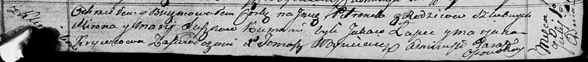

**Сушко Петронеля Миронова (Suszkowna Petronela)**

1 июля 1817 г -- крещение (НИАБ 136-13-894, лист 96об, №44/1817-р
(ориг)).

**НИАБ 136-13-894:** Лист 96об. **Метрическая запись №44/1817-р
(ориг).**

{width="6.496527777777778in"
height="0.6953138670166229in"}

Осовская Покровская церковь. 1 июля 1817 года. Метрическая запись о
крещении.

Suszkowna Petroneła -- дочь родителей с деревни Клинники.

Suszko Miron -- отец.

Suszkowa Marija -- мать.

Łapieć Jakaw -- кум.

Krywcowa Marjana -- кума.

Woyniewicz Tomasz -- ксёндз.
