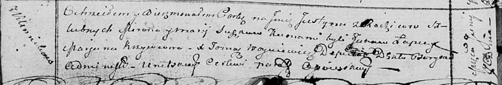

**Сушко Юстына Миронова младшая (Suszkowna Justyna)**

7 июня 1814 г -- крещение (НИАБ 136-13-894, лист 89об, №36/1814-р
(ориг)).

**НИАБ 136-13-894:** Лист 89об. **Метрическая запись №36/1814-р
(ориг).**

Осовская Покровская церковь. 7 июня 1814 года. Метрическая запись о
крещении.

Suszkowna Justyna -- дочь родителей с деревни Клинники.

Suszko Miron -- отец.

Suszkowa Marija -- мать.

Łapieć Jakow -- кум.

Krywcowa Marjana -- кума.

Woyniewicz Tomasz -- ксёндз.
