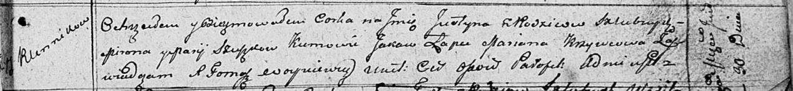

**Сушко Юстына Миронова (Szuszkowna Justyna)**

30 июня 1811 г -- крещение (НИАБ 136-13-894, лист 81, №32/1811-р
(ориг)).

**НИАБ 136-13-894:** Лист 81. **Метрическая запись №32/1811-р (ориг).**

Осовская Покровская церковь. 30 июня 1811 года. Метрическая запись о
крещении.

Szuszkowna Justyna -- дочь родителей с деревни Клинники.

Szuszko Miron -- отец.

Szuszkowa Marija -- мать.

Łapec Jakow -- кум.

Krzywcowa Marjana -- кума.

Woyniewicz Tomasz -- ксёндз.
