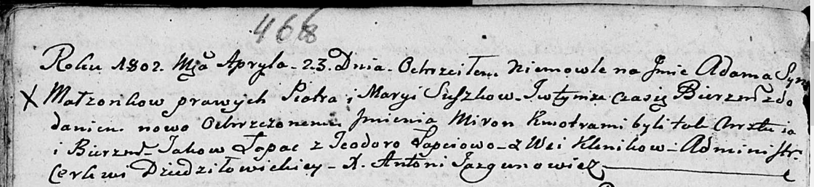

**Сушко Марыя (Suszkowa Marya)**

23 апреля 1802 г -- крещение сына Адама Мирона (НИАБ 136-13-894, лист
46об, №13/1802-р (ориг)).

**НИАБ 136-13-894:** Лист 46об. **Метрическая запись №13/1802-р
(ориг).**

Дедиловичская Покровская церковь. 23 апреля 1802 года. Метрическая
запись о крещении.

Suszko Adam Miron -- сын родителей с деревни Клинники.

Suszko Piotr -- отец.

Suszkowa Maryia -- мать.

Łapać Jakow -- кум.

Łapciowa Teodora -- кума.

Jazgunowicz Antoni -- ксёндз.
