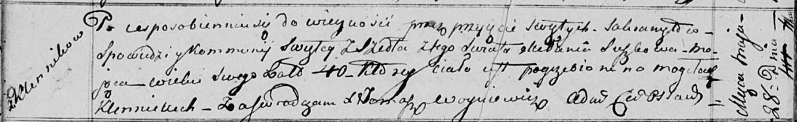

**Сушко Мелания (Suszkowa Mełania)**

28 мая 1817 г -- отпевание, умерла в возрасте 40 лет (родилась около
1777 г) (НИАБ 136-13-919, лист 30об, №10/1817-у (ориг)).

**НИАБ 136-13-919:** Лист 30об. **Метрическая запись №10/1817-у
(ориг).**

Осовская униатская церковь. 28 мая 1817 года. Метрическая запись об
отпевании.

Suszkowa Mełania -- умершая, 40 лет, с деревни Клинники, похоронена на
кладбище деревни Клинники.

Woyniewicz Tomasz -- ксёндз.
