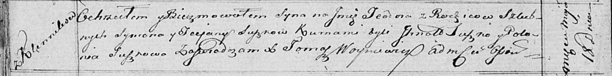

**Сушко Сымон (Szuszko, Suszko Symon)**

1 ноября 1803 г -- венчание с девкой Татьяной Кикило с деревни Клинники
(НИАБ 136-13-920, лист 9об, №8/1803-б (ориг)).

27 ноября 1810 г -- крещение дочери Зеновии (НИАБ 136-13-894, лист 79об,
№60/1810-р (ориг)).

18 мая 1816 г -- крещение сына Тодора (НИАБ 136-13-894, лист 93об,
№10/1816-р (ориг)).

**НИАБ 136-13-920:** Лист 9об. **Метрическая запись №8/1803-б (ориг).**

{width="6.496527777777778in"
height="1.6025076552930884in"}

Дедиловичская Покровская церковь. 1 ноября 1803 года. Метрическая запись
о венчании.

Suszko Symon -- жених, молодой, с деревни \[Клинники\].

Kikiłowna Taciana -- невеста, девка, с деревни \[Клинники\].

Łapac Jakow -- свидетель.

Suszko Leon -- свидетель, с деревни Клинники.

Jazgunowicz Antoni -- ксёндз.

**НИАБ 136-13-894:** Лист 79об. **Метрическая запись №60/1810-р
(ориг).**

{width="6.496527777777778in"
height="0.8381321084864392in"}

Осовская Покровская церковь. 27 ноября 1810 года. Метрическая запись о
крещении.

Szuszkowna Zienowia -- дочь родителей с деревни Клинники.

Szuszko Symon -- отец.

Szuszkowa Tacjana -- мать.

Randak Jwan -- кум.

Skakunowa Teodora -- кума.

Woyniewicz Tomasz -- ксёндз.

**НИАБ 136-13-894:** Лист 93об. **Метрическая запись №10/1816-р
(ориг).**

{width="6.496527777777778in"
height="0.8133234908136483in"}

Осовская Покровская церковь. 18 мая 1816 года. Метрическая запись о
крещении.

Suszko Teodor -- сын родителей с деревни Клинники.

Suszko Symon -- отец.

Suszkowa Taciana -- мать.

Suszko Jhnat -- кум.

Suszkowa Połonia -- кума.

Woyniewicz Tomasz -- ксёндз.
