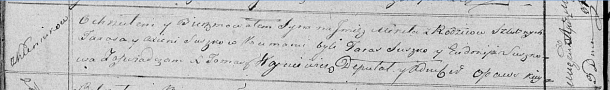

**Сушко Аксеня (Suszkowa Axienia)**

3 апреля 1819 г -- крещение сына Микиты (НИАБ 136-13-894, лист 100об,
№18/1819-р (ориг)).

**НИАБ 136-13-894:** Лист 100об. **Метрическая запись №18/1819-р
(ориг).**

Осовская Покровская церковь. 3 апреля 1819 года. Метрическая запись о
крещении.

Suszko Mikita -- сын родителей с деревни Клинники.

Suszko Taras -- отец.

Suszkowa Axienia -- мать.

Suszko Taras -- кум.

Suszkowa Eudokija -- кума.

Woyniewicz Tomasz -- ксёндз.
