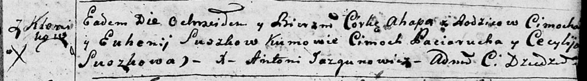

**Сушко Агапа Цимохова (Suszkowna Ahapa)**

20 февраля 1793 г -- крещение (НИАБ 136-13-894, лист 19, №22/1793-р
(ориг)).

**НИАБ 136-13-894:** Лист 19. **Метрическая запись №22/1793-р (ориг).**

Дедиловичская Покровская церковь. 20 февраля 1793 года. Метрическая
запись о крещении.

Suszkowna Ahapa -- дочь родителей с деревни Клинники.

Suszko Cimoch -- отец.

Suszkowa Euhenija -- мать.

Paciarucha Cimoch - кум.

Suszkowa Cecylija - кума.

Jazgunowicz Antoni -- ксёндз.
