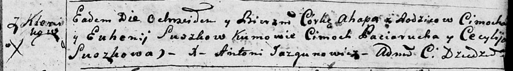
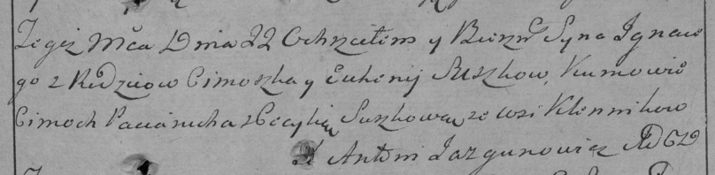

**Сушко Цимох (Suszko Cimoch, Cimoszka)**

20 февраля 1793 г -- крещение дочери Агапы (НИАБ 136-13-894, лист 19,
№22/1793-р (ориг)).

22 декабря 1795 г -- крещение сына Игнация (НИАБ 136-13-894, лист 27,
№62/1795-р (ориг)), (РГИА 823-2-18, лист 254, №45/1795-р (коп)).

6 апреля 1799 г -- крестный отец Грыгорыя (ошибочно Яна Прокопа 24
апреля), сына Лапецов Изыдора и Параски с деревни Клинники (НИАБ
136-13-938, лист 241об, №17/1799-р (коп)).

2 февраля 1802 г -- свидетель венчания молодого Авдакима Скакуна с
деревни Клинники с Хведорой Лапец с деревни Осово (НИАБ 136-13-920, лист
8, №2/1802-б (ориг)).

**НИАБ 136-13-894:** Лист 19. **Метрическая запись №22/1793-р (ориг).**

Дедиловичская Покровская церковь. 20 февраля 1793 года. Метрическая
запись о крещении.

Suszkowna Ahapa -- дочь родителей с деревни Клинники.

Suszko Cimoch -- отец.

Suszkowa Euhenija -- мать.

Paciarucha Cimoch - кум.

Suszkowa Cecylija - кума.

Jazgunowicz Antoni -- ксёндз.

**НИАБ 136-13-894:** Лист 27. **Метрическая запись №62/1795-р (ориг).**

Дедиловичская Покровская церковь. 22 декабря 1795 года. Метрическая
запись о крещении.

Suszko Jhnacy -- сын родителей с деревни Клинники.

Suszko Cimoszka -- отец.

Suszkowa Euhenija -- мать.

Paciarucho Cimoszka - кум.

Suszkowa Cecylija - кума.

Jazgunowicz Antoni -- ксёндз.

**РГИА 823-2-18:** Лист 254. **Метрическая запись №45/1795-р (коп).**

Дедиловичская Покровская церковь. 22 декабря 1795 года. Метрическая
запись о крещении.

Suszko Jgnacy -- сын родителей с деревни Клинники.

Suszko Cimoszka -- отец.

Suszkowa Euhenija -- мать.

Paciarucha Cimoch -- кум.

Suszkowa Cecylia -- кума.

Jazgunowicz Antoni -- ксёндз.

**НИАБ 136-13-938:** Лист 241об. **Метрическая запись №17/1799-р
(коп).**

(См. тж. НИАБ 136-13-894, лист 38об, №18/1799-р (ориг); РГИА 823-2-18,
лист 269, №18/1799-р (коп))

Дедиловичская Покровская церковь. 24 апреля 1799 года. Метрическая
запись о крещении.

Łapać Jan Prokop -- сын родителей с деревни Клинники.

Łapać Jzydor -- отец.

Łapciowa Parasia -- мать.

Suszko Cimoszka -- кум, с деревни Разлитье.

Suszkowa Kulina - кума, с деревни Разлитье.

Jazgunowicz Antoni -- ксёндз.

**НИАБ 136-13-920:** Лист 8. **Метрическая запись №2/1802-б (ориг).**

Дедиловичская Покровская церковь. 2 февраля 1802 года. Метрическая
запись о венчании.

Skakun Awdakim -- жених, молодой, с деревни Клинники.

Łapciowa Chwiedora -- невеста, с деревни Осовo.

Suszko Cimoszka -- свидетель, с деревни Клинники.

Skakun Maisey -- свидетель, с деревни Осовo.

Jazgunowicz Antoni -- ксёндз.
