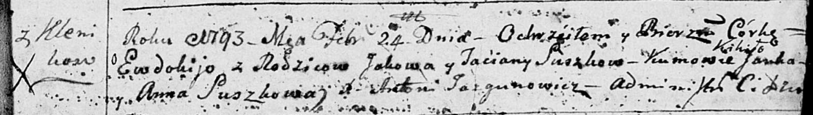

**Сушко Евдокия Яковова (Suszkowna Ewdokija)**

24 февраля 1793 г -- крещение (НИАБ 136-13-894, лист 19, №24/1793-р
(ориг)).

**НИАБ 136-13-894:** Лист 19. **Метрическая запись №24/1793-р (ориг).**

Дедиловичская Покровская церковь. 24 февраля 1793 года. Метрическая
запись о крещении.

Suszkowna Ewdokija -- дочь родителей с деревни Клинники.

Suszko Jakow -- отец.

Suszkowa Taćiana -- мать.

Kikiło Janka - кум.

Suszkowa Anna - кума.

Jazgunowicz Antoni -- ксёндз.
