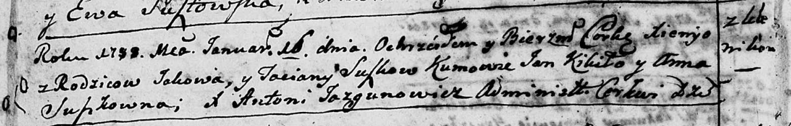

**Сушко Ксеня Яковова (Suszkowna Xienya)**

16 января 1788 г -- крещение (НИАБ 136-13-894, лист 3об, №7/1788-р
(ориг)).

**НИАБ 136-13-894:** Лист 3об. **Метрическая запись №7/1788-р (ориг).**

Дедиловичская Покровская церковь. 16 января 1788 года. Метрическая
запись о крещении.

Suszkowna Xienya -- дочь родителей с деревни Клинники.

Suszko Jakow -- отец.

Suszkowa Taciana -- мать.

Kikiło Jan - кум.

Suszkowna Anna - кума.

Jazgunowicz Antoniusz -- ксёндз.
