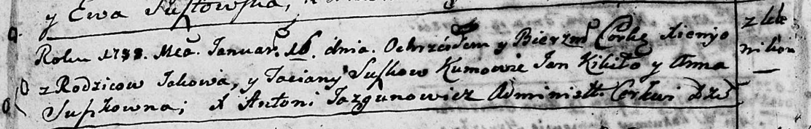
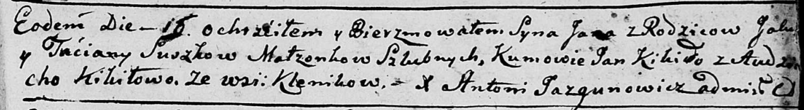
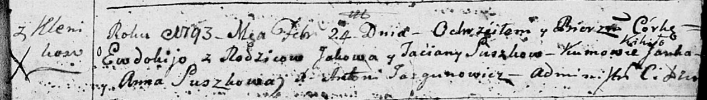
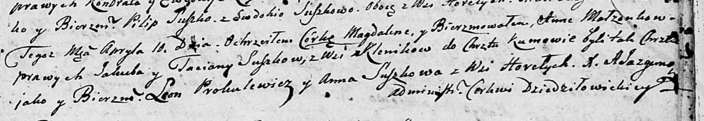
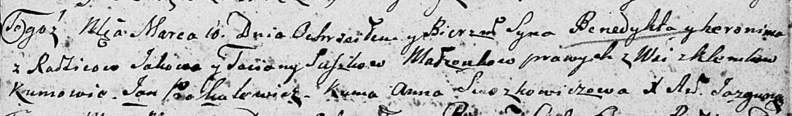

**Сушко Татьяна (Suszkowa Taciana, Taćiana)**

16 января 1788 г -- крещение дочери Ксени (НИАБ 136-13-894, лист 3об,
№7/1788-р (ориг)).

16 сентября 1790 г -- крещение сына Яна (НИАБ 136-13-894, лист 11,
№61/1790-р (ориг)), (РГИА 823-2-18, лист 240об, №25/1790-р (коп)).

24 февраля 1793 г -- крещение дочери Евдокии (НИАБ 136-13-894, лист 19,
№24/1793-р (ориг)).

10 апреля 1805 г -- крещение дочери Магдалены Анны (НИАБ 136-13-894,
лист 57, №22/1805-р (ориг)).

10 марта 1807 г -- крещение Бенедыкта Геронима (НИАБ 136-13-894, лист
62, №15/1807-р (ориг)).

**НИАБ 136-13-894:** Лист 3об. **Метрическая запись №7/1788-р (ориг).**

Дедиловичская Покровская церковь. 16 января 1788 года. Метрическая
запись о крещении.

Suszkowna Xienya -- дочь родителей с деревни Клинники.

Suszko Jakow -- отец.

Suszkowa Taciana -- мать.

Kikiło Jan - кум.

Suszkowna Anna - кума.

Jazgunowicz Antoniusz -- ксёндз.

**НИАБ 136-13-894:** Лист 11. **Метрическая запись №61/1790-р (ориг).**

Дедиловичская Покровская церковь. 16 сентября 1790 года. Метрическая
запись о крещении.

Suszko Jan -- сын родителей с деревни Клинники.

Suszko Jakub -- отец.

Suszkowa Taciana -- мать.

Kikiło Jan - кум.

Kikiłowa Audziucha - кума.

Jazgunowicz Antoni -- ксёндз.

**РГИА 823-2-18:** Лист 240об. **Метрическая запись №25/1790-р (коп).**

Дедиловичская Покровская церковь. 16 сентября 1790 года. Метрическая
запись о крещении.

Suszko Jan -- сын родителей с деревни Клинники.

Suszko Jakub -- отец.

Suszkowa Tacianna -- мать.

Kikiło Jan -- кум.

Kikiłowa Eudokia - кума.

Jazgunowicz Antoni -- ксёндз.

**НИАБ 136-13-894:** Лист 19. **Метрическая запись №24/1793-р (ориг).**

Дедиловичская Покровская церковь. 24 февраля 1793 года. Метрическая
запись о крещении.

Suszkowna Ewdokija -- дочь родителей с деревни Клинники.

Suszko Jakow -- отец.

Suszkowa Taćiana -- мать.

Kikiło Janka - кум.

Suszkowa Anna - кума.

Jazgunowicz Antoni -- ксёндз.

**НИАБ 136-13-894:** Лист 57. **Метрическая запись №22/1805-р (ориг).**

Дедиловичская Покровская церковь. 10 апреля 1805 года. Метрическая
запись о крещении.

Suszkowna Magdalena Anna -- дочь родителей с деревни Клинники.

Suszko Jakub -- отец.

Suszkowa Taciana -- мать.

Prokulewicz Leon -- кум.

Suszkowa Anna -- кума, с деревни Горелое.

Jazgunowicz Antoni -- ксёндз.

**НИАБ 136-13-894:** Лист 62. **Метрическая запись №15/1807-р (ориг).**

Дедиловичская Покровская церковь. 10 марта 1807 года. Метрическая запись
о крещении.

Suszko Benedykt Heronim -- сын родителей с деревни Клинники.

Suszko Jakow -- отец.

Suszkowa Taciana -- мать.

Prokulewicz Jan -- кум.

Suszkowiczowa Anna -- кума.

Jazgunowicz Antoni -- ксёндз.
