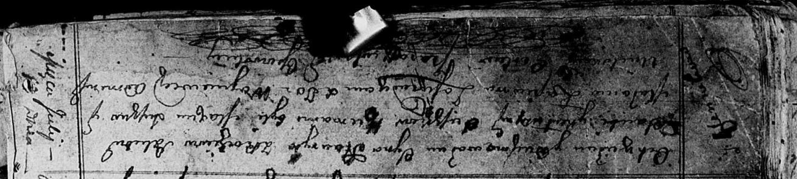

**Сушко Катерына (Suszkowa Katerzyna)**

10 июля 1813 г -- крещение сына Гаврылы (НИАБ 136-13-894, лист 86об,
№17/1813-р (ориг)).

**НИАБ 136-13-894:** Лист 86об. **Метрическая запись №17/1813-р
(ориг).**

{width="6.496527777777778in"
height="1.4630435258092738in"}

Осовская Покровская церковь. 10 июля 1813 года. Метрическая запись о
крещении.

Suszko Hauryła -- сын родителей с деревни Клинники.

Suszko Janka -- отец.

Suszkowa Katerzyna -- мать.

Suszko Maxim -- кум.

Łapciowa Małania -- кума.

Woyniewicz Tomasz -- ксёндз.
