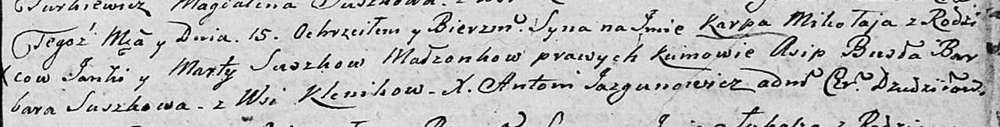

**Сушко Янка (Suszko Janka)**

15 октября 1805 г -- крещение сына Карпа Миколая (НИАБ 136-13-894, лист
58, №44/1805-р (ориг)).

**НИАБ 136-13-894:** Лист 58. **Метрическая запись №44/1805-р (ориг).**

{width="6.496527777777778in"
height="0.8274037620297463in"}

Дедиловичская Покровская церковь. 15 октября 1805 года. Метрическая
запись о крещении.

Suszko Karp Mikołay -- сын родителей с деревни Клинники.

Suszko Janka -- отец.

Suszkowa Marta -- мать.

Busla Asip -- кум.

Suszkowa Barbara -- кума.

Jazgunowicz Antoni -- ксёндз.
