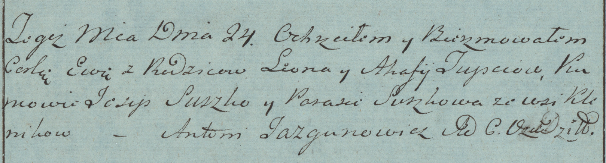

**Тупоть Ева Леонова (Tupcewna Ewa)**

24 июня 1783 г -- крещение (РГИА 823-2-18, лист 224об, №16/1783-р
(коп)).

**РГИА 823-2-18:** Лист 224об. **Метрическая запись №16/1783-р (коп).**

Дедиловичская Покровская церковь. 24 июня 1783 года. Метрическая запись
о крещении.

Tupciowna Ewa -- дочь родителей с деревни Клинники.

Tupoć Leon -- отец.

Tupciowa Ahafia -- мать.

Suszko Josip -- кум.

Suszkowa Parasia - кума.

Jazgunowicz Antoni -- ксёндз.
