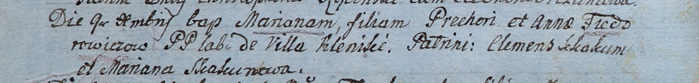

**Федорович Анна (Fiedorowiczowa Anna)**

9 декабря 1805 г -- крещение дочери Марьяны (НИАБ 937-4-32, лист 12об,
№44/1805-р).

**НИАБ 937-4-32:** Лист 12об. **Метрическая запись №44/1805-р.**

{width="6.496527777777778in"
height="0.7756944444444445in"}

Дедиловичский костел Наисвятейшего Сердца Иисуса. 9 декабря 1805 года.
Метрическая запись о крещении.

Fiedorowiczowa Mariana -- дочь крестьян с деревни Клинники.

Fiedorowicz Prechor -- отец.

Fiedorowiczowa Anna -- мать.

Skakun Clemens -- крестный отец.

Skakunowa Mariana -- крестная мать.

Linhart Hiacinthus -- ксёндз.
