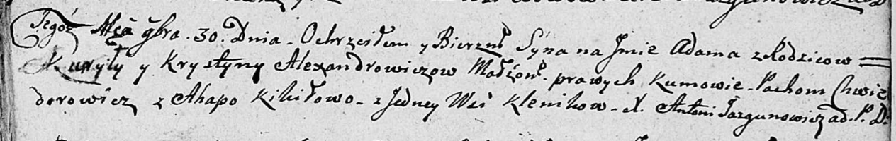

**Федорович Пахом (Chwiedorowicz Pachom)**

30 ноября 1808 г -- крестный отец Адама, сына Александровичей Курылы и
Крыстыны с деревни Клинники (НИАБ 136-13-894, лист 73, №46/1808-р
(ориг)).

**НИАБ 136-13-894:** Лист 73. **Метрическая запись №46/1808-р (ориг).**

Дедиловичская Покровская церковь. 30 ноября 1808 года. Метрическая
запись о крещении.

Alexandrowicz Adam -- сын родителей с деревни Клинники.

Alexandrowicz Kuryła -- отец.

Alexandrowiczowa Krystyna -- мать.

Chwiedorowicz Pachom -- кум, с деревни Клинники.

Kikiłowa Ahapa -- кума, с деревни Клинники.

Jazgunowicz Antoni -- ксёндз.
