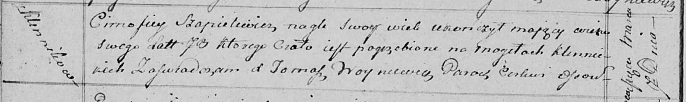

**Шапелевич Тимофей (Szapielewicz Cimofiey)**

7 марта 1815 г -- отпевание, умер внезапно в возрасте 70 лет (родился
около 1745 г) (НИАБ 136-13-919, лист 28об, №3/1815-у (ориг)).

**НИАБ 136-13-919:** Лист 28об. **Метрическая запись №3/1815-у (ориг).**

{width="6.496527777777778in"
height="0.9805555555555555in"}

Осовская униатская церковь. 7 марта 1815 года. Метрическая запись об
отпевании.

Szapielewicz Cimofiey -- умер внезапно, 70 лет, с деревни Клинники,
похоронен на кладбище деревни Клинники.

Woyniewicz Tomasz -- ксёндз.
