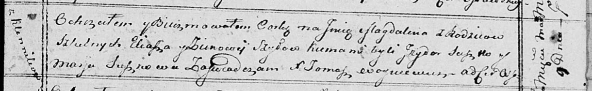

**Шило Магдалена Ильина (Szyłowna Magdalena)**

9 марта 1815 г -- крещение (НИАБ 136-13-894, лист 92, №12/1815-р
(ориг)).

**НИАБ 136-13-894:** Лист 92. **Метрическая запись №12/1815-р (ориг).**

{width="6.496527777777778in"
height="1.0010651793525809in"}

Осовская Покровская церковь. 9 марта 1815 года. Метрическая запись о
крещении.

Szyłowna Magdalena -- дочь родителей с деревни Клинники.

Szyło Eliasz -- отец.

Szyłowa Zinowija -- мать.

Suszko Jzydor -- кум.

Suszkowa Marja -- кума.

Woyniewicz Tomasz -- ксёндз.
