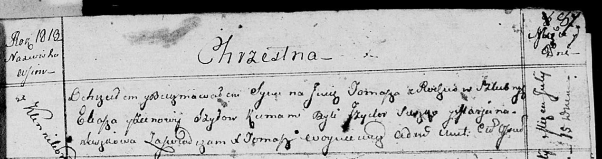

**Шило Томаш Ильин (Szyło Tomasz)**

15 июля 1813 г -- крещение (НИАБ 136-13-894, лист 87, №18/1813-р
(ориг)).

**НИАБ 136-13-894:** Лист 87. **Метрическая запись №18/1813-р (ориг).**

{width="6.496527777777778in"
height="1.7178346456692914in"}

Осовская Покровская церковь. 15 июля 1813 года. Метрическая запись о
крещении.

Szyło Tomasz -- сын родителей с деревни Клинники.

Szyło Eliasz -- отец.

Szyłowa Zienowia -- мать.

Suszko Jzydor -- кум.

Suszkowa Marjana -- кума.

Woyniewicz Tomasz -- ксёндз.
