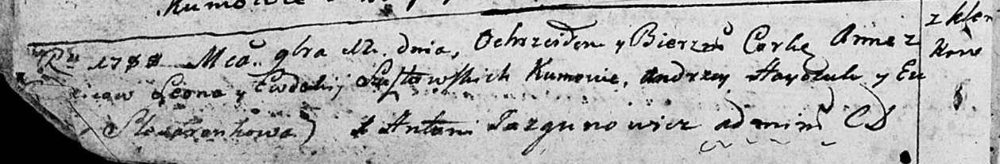

**Шустовская Анна Леонова (Szustowska Anna)**

12 ноября 1788 г -- крещение (НИАБ 136-13-894, лист 5об, №64/1788-р
(ориг)).

**НИАБ 136-13-894:** Лист 5об. **Метрическая запись №64/1788-р (ориг).**

Дедиловичская Покровская церковь. 12 ноября 1788 года. Метрическая
запись о крещении.

Szusztowska Anna -- дочь родителей с деревни Клинники.

Szusztowski Leon-- отец.

Szusztowska Ewdokija -- мать.

Hayczuk Andrzey - кум.

Slesaronkowa Ew\... - кума.

Jazgunowicz Antoniusz -- ксёндз.
