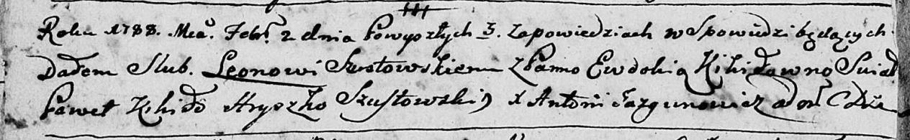

**Шустовская (Кикило) Евдокия (Szustowska Ewdokija, Ewdokia z Kikiłow)**

2 февраля 1788 г -- венчание с Леоном Шустовским (НИАБ 136-13-894, лист
66об, №2/1788-б (ориг)).

12 ноября 1788 г -- крещение дочери Анны (НИАБ 136-13-894, лист 5об,
№64/1788-р (ориг)).

3 ноября 1790 г -- крещение сына Павла (НИАБ 136-13-894, лист 11об,
№79/1790-р (ориг)).

**НИАБ 136-13-894:** Лист 66об. **Метрическая запись №2/1788-б (ориг).**

Дедиловичская Покровская церковь. 2 февраля 1788 года. Метрическая
запись о венчании.

Szustowski Leon -- жених с деревни \[Клинники\].

Kikiłowna Ewdokia -- невеста.

Kikiło Paweł -- свидетель.

Szustowski Hryszko -- свидетель.

Jazgunowicz Antoni -- ксёндз.

**НИАБ 136-13-894:** Лист 5об. **Метрическая запись №64/1788-р (ориг).**

Дедиловичская Покровская церковь. 12 ноября 1788 года. Метрическая
запись о крещении.

Szusztowska Anna -- дочь родителей с деревни Клинники.

Szusztowski Leon-- отец.

Szusztowska Ewdokija -- мать.

Hayczuk Andrzey - кум.

Slesaronkowa Ew\... - кума.

Jazgunowicz Antoniusz -- ксёндз.

**НИАБ 136-13-894:** Лист 11об. **Метрическая запись №79/1790-р
(ориг).**

Дедиловичская Покровская церковь. 3 ноября 1790 года. Метрическая запись
о крещении.

Sustowski Paweł -- сын родителей с деревни Клинники.

Sustowski Leon -- отец.

Sustowska Ewdokia -- мать.

Hayczuk Andrzey - кум.

Suszkowiczowa Ewdokia - кума.

Jazgunowicz Antoni -- ксёндз.
