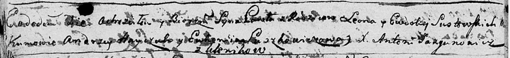

**Шустовский Павел Леонов (Sustowski Paweł)**

3 ноября 1790 г -- крещение (НИАБ 136-13-894, лист 11об, №79/1790-р
(ориг)).

**НИАБ 136-13-894:** Лист 11об. **Метрическая запись №79/1790-р
(ориг).**

Дедиловичская Покровская церковь. 3 ноября 1790 года. Метрическая запись
о крещении.

Sustowski Paweł -- сын родителей с деревни Клинники.

Sustowski Leon -- отец.

Sustowska Ewdokia -- мать.

Hayczuk Andrzey - кум.

Suszkowiczowa Ewdokia - кума.

Jazgunowicz Antoni -- ксёндз.
