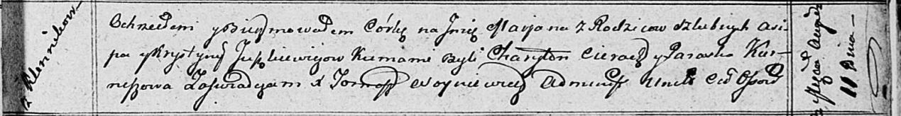

**Юшкевич Асип (Juszkiewicz Asip)**

11 августа 1812 г -- крещение дочери Марьяны (НИАБ 136-13-894, лист 85,
№40/1812-р (ориг)).

**НИАБ 136-13-894:** Лист 85. **Метрическая запись №40/1812-р (ориг).**

Осовская Покровская церковь. 11 августа 1812 года. Метрическая запись о
крещении.

Juszkiewiczowna Marjana -- дочь родителей с деревни Клинники.

Juszkiewicz Asip -- отец.

Juszkiewiczowna Krystyna -- мать.

Cierach Charyton -- кум.

Kurneszowa Paraska -- кума.

Woyniewicz Tomasz -- ксёндз.
