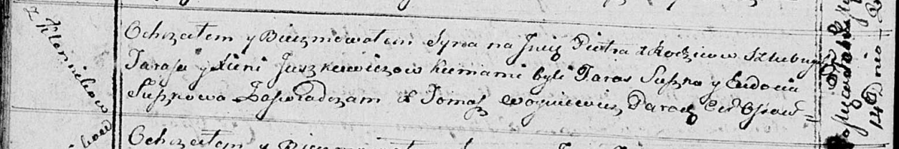

**Юшкевич Ксеня (Juszkiewiczowa Xienia)**

14 февраля 1815 г -- крещение сына Петра (НИАБ 136-13-894, лист 91об,
№6/1815-р (ориг)).

**НИАБ 136-13-894:** Лист 91об. **Метрическая запись №6/1815-р (ориг).**

Осовская Покровская церковь. 14 февраля 1815 года. Метрическая запись о
крещении.

Juszkiewicz Piotr -- сын родителей с деревни Клинники.

Juszkiewicz Taras -- отец.

Juszkiewiczowa Xienia -- мать.

Suszko Taras -- кум.

Suszkowa Eudokia -- кума.

Woyniewicz Tomasz -- ксёндз.
